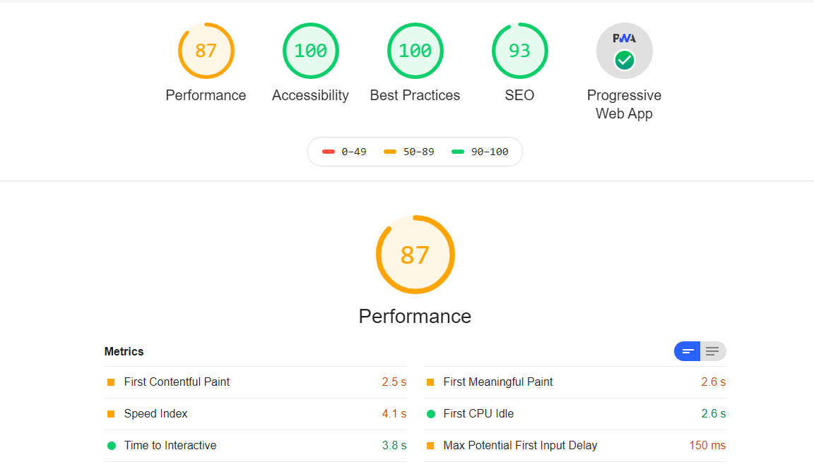

## Lighthouse Playwright - NPM Package

[](https://www.npmjs.com/package/playwright-lighthouse)
[](https://github.com/prettier/prettier)
[](https://www.npmjs.com/package/playwright-lighthouse)

[Lighthouse](https://developers.google.com/web/tools/lighthouse) is a tool developed by Google that analyzes web apps and web pages, collecting modern performance metrics and insights on developer best practices.

[Playwright](https://www.npmjs.com/package/playwright) is a Node library to automate Chromium, Firefox and WebKit with a single API. Playwright is built to enable cross-browser web automation that is ever-green, capable, reliable and fast.

The purpose of this package is to produce web audit report for several pages in connected mode and in an automated (programmatic) way.

## Usage

### Installation

Add the `playwright-lighthouse`, `playwright` & `lighthouse` libraries to your project:

```sh
$ yarn add -D playwright-lighthouse playwright lighthouse
# or
$ npm install --save-dev playwright-lighthouse playwright lighthouse
```

### In your code

After completion of the Installation, you can use `playwright-lighthouse` in your code to audit the current page.

In your test code you need to import `playwright-lighthouse` and assign a `port` for the lighthouse scan. You can choose any non-allocated port.

```js
const { playAudit } = require('playwright-lighthouse');
const playwright = require('playwright');

describe('audit example', () => {
  it('open browser', async () => {
    const browser = await playwright['chromium'].launch({
      args: ['--remote-debugging-port=9222'],
    });
    const page = await browser.newPage();
    await page.goto('https://angular.io/');

    await playAudit({
      page: page,
      port: 9222,
    });

    await browser.close();
  });
});
```

## Thresholds per tests

If you don't provide any threshold argument to the `playAudit` command, the test will fail if at least one of your metrics is under `100`.

You can make assumptions on the different metrics by passing an object as argument to the `playAudit` command:

```javascript
const { playAudit } = require('playwright-lighthouse');
const playwright = require('playwright');

describe('audit example', () => {
  it('open browser', async () => {
    const browser = await playwright['chromium'].launch({
      args: ['--remote-debugging-port=9222'],
    });
    const page = await browser.newPage();
    await page.goto('https://angular.io/');

    await playAudit({
      page: page,
      thresholds: {
        performance: 50,
        accessibility: 50,
        'best-practices': 50,
        seo: 50,
        pwa: 50,
      },
      port: 9222,
    });

    await browser.close();
  });
});
```

If the Lighthouse analysis returns scores that are under the one set in arguments, the test will fail.

You can also make assumptions only on certain metrics. For example, the following test will **only** verify the "correctness" of the `performance` metric:

```javascript
await playAudit({
  page: page,
  thresholds: {
    performance: 85,
  },
  port: 9222,
});
```

This test will fail only when the `performance` metric provided by Lighthouse will be under `85`.

## Passing different Lighthouse config to playwright-lighthouse directly

You can also pass any argument directly to the Lighthouse module using the second and third options of the command:

```js
const thresholdsConfig = {
  /* ... */
};

const lighthouseOptions = {
  /* ... your lighthouse options */
};

const lighthouseConfig = {
  /* ... your lighthouse configs */
};

await playAudit({
  thresholds: thresholdsConfig,
  opts: lighthouseOptions,
  config: lighthouseConfig,

  /* ... other configurations */
});
```

You can pass default lighthouse configs like so:

```js
import lighthouseDesktopConfig from 'lighthouse/lighthouse-core/config/lr-desktop-config';

await playAudit({
  thresholds: thresholdsConfig,
  opts: lighthouseOptions,
  config: lighthouseDesktopConfig,

  /* ... other configurations */
});
```

Sometimes it's important to pass a parameter _disableStorageReset_ as false. You can easily make it like this:

```js
const opts = {
  disableStorageReset: false,
};

await playAudit({
  page,
  port: 9222,
  opts,
});
```

## Running lighthouse on authenticated routes

Playwright by default does not share any context (eg auth state) between pages. Lighthouse will open a new page and thus any previous authentication steps are void. To persist auth state you need to use a persistent context:

```js
const os = require('os');
const { playAudit } = require('playwright-lighthouse');
const { chromium } = require('playwright');

describe('audit example', () => {
  it('open browser', async () => {
    const userDataDir = path.join(os.tmpdir(), 'pw', String(Math.random()));
    const context = await chromium.launchPersistentContext(userDataDir, {
      args: ['--remote-debugging-port=9222'],
    });
    const page = await context.newPage();
    await page.goto('http://localhost:3000/');

    // Perform login steps here which will save to cookie or localStorage

    // When lighthouse opens a new page the storage will be persisted meaning the new page will have the same user session
    await playAudit({
      page: page,
      port: 9222,
    });

    await context.close();
  });
});
```

Clean up the tmp directories on playwright teardown:

```ts
import rimraf from 'rimraf';
import os from 'os';
import path from 'path';

function globalSetup() {
  return () => {
    const tmpDirPath = path.join(os.tmpdir(), 'pw');
    rimraf(tmpDirPath, console.log);
  };
}

export default globalSetup;
```

## Usage with Playwright Test Runner

```ts
import { chromium } from 'playwright';
import type { Browser } from 'playwright';
import { playAudit } from 'playwright-lighthouse';
import { test as base } from '@playwright/test';
import getPort from 'get-port';

export const lighthouseTest = base.extend<
  {},
  { port: number; browser: Browser }
>({
  port: [
    async ({}, use) => {
      // Assign a unique port for each playwright worker to support parallel tests
      const port = await getPort();
      await use(port);
    },
    { scope: 'worker' },
  ],

  browser: [
    async ({ port }, use) => {
      const browser = await chromium.launch({
        args: [`--remote-debugging-port=${port}`],
      });
      await use(browser);
    },
    { scope: 'worker' },
  ],
});

lighthouseTest.describe('Lighthouse', () => {
  lighthouseTest('should pass lighthouse tests', async ({ page, port }) => {
    await page.goto('http://example.com');
    await page.waitForSelector('#some-element');
    await playAudit({
      page,
      port,
    });
  });
});
```

### Running lighthouse on authenticated routes with the test runner

```ts
import os from 'os';
import getPort from 'get-port';
import { BrowserContext, chromium, Page } from 'playwright';
import { test as base } from '@playwright/test';
import { playAudit } from 'playwright-lighthouse';

export const lighthouseTest = base.extend<
  {
    authenticatedPage: Page;
    context: BrowserContext;
  },
  {
    port: number;
  }
>({
  // We need to assign a unique port for each lighthouse test to allow
  // lighthouse tests to run in parallel
  port: [
    async ({}, use) => {
      const port = await getPort();
      await use(port);
    },
    { scope: 'worker' },
  ],

  // As lighthouse opens a new page, and as playwright does not by default allow
  // shared contexts, we need to explicitly create a persistent context to
  // allow lighthouse to run behind authenticated routes.
  context: [
    async ({ port }, use) => {
      const userDataDir = path.join(os.tmpdir(), 'pw', String(Math.random()));
      const context = await chromium.launchPersistentContext(userDataDir, {
        args: [`--remote-debugging-port=${port}`],
      });
      await use(context);
      await context.close();
    },
    { scope: 'test' },
  ],

  authenticatedPage: [
    async ({ context, page }, use) => {
      // Mock any requests on the entire context
      await context.route('https://example.com/token', (route) => {
        return route.fulfill({
          status: 200,
          body: JSON.stringify({
            // ...
          }),
          headers: {
            // ...
          },
        });
      });

      await page.goto('http://localhost:3000');

      // Setup your auth state by inserting cookies or localStorage values
      await insertAuthState(page);

      await use(page);
    },
    { scope: 'test' },
  ],
});

lighthouseTest.describe('Authenticated route', () => {
  lighthouseTest(
    'should pass lighthouse tests',
    async ({ port, authenticatedPage: page }) => {
      await page.goto('http://localhost:3000/my-profile');
      await playAudit({
        page,
        port,
      });
    }
  );
});
```

### Running lighthouse on authenticated routes with globalSetup

In case you have a [`globalSetup`](https://playwright.dev/docs/test-auth) script in your test you might want to reuse saved state instead of running auth before every test.  
Additionally, you may pass `url` instead of `page` to speedup execution and save resources.

```ts
import os from 'os';
import path from 'path';
import { chromium, test as base } from '@playwright/test';
import type { BrowserContext } from '@playwright/test';
import getPort from 'get-port'; // version ^5.1.1 due to issues with imports in playwright 1.20.1

export const lighthouseTest = base.extend<
  { context: BrowserContext },
  { port: number }
>({
  port: [
    async ({}, use) => {
      // Assign a unique port for each playwright worker to support parallel tests
      const port = await getPort();
      await use(port);
    },
    { scope: 'worker' },
  ],

  context: [
    async ({ port, launchOptions }, use) => {
      const userDataDir = path.join(os.tmpdir(), 'pw', String(Math.random()));
      const context = await chromium.launchPersistentContext(userDataDir, {
        args: [
          ...(launchOptions.args || []),
          `--remote-debugging-port=${port}`,
        ],
      });

      // apply state previously saved in the the `globalSetup`
      await context.addCookies(require('../../state-chrome.json').cookies);

      await use(context);
      await context.close();
    },
    { scope: 'test' },
  ],
});

lighthouseTest.describe('Authenticated route after globalSetup', () => {
  lighthouseTest('should pass lighthouse tests', async ({ port }) => {
    // it's possible to pass url directly instead of a page
    // to avoid opening a page an extra time and keeping it opened
    await playAudit({
      url: 'http://localhost:3000/my-profile',
      port,
    });
  });
});
```

## Generating audit reports

`playwright-lighthouse` library can produce Lighthouse CSV, HTML and JSON audit reports, that you can host in your CI server. These reports can be useful for ongoing audits and monitoring from build to build.

```js
await playAudit({
  /* ... other configurations */

  reports: {
    formats: {
      json: true, //defaults to false
      html: true, //defaults to false
      csv: true, //defaults to false
    },
    name: `name-of-the-report`, //defaults to `lighthouse-${new Date().getTime()}`
    directory: `path/to/directory`, //defaults to `${process.cwd()}/lighthouse`
  },
});
```

Sample HTML report:



playAudit function also provides a promise that resolves with the Lighthouse result object containing the LHR (Lighthouse report in JSON format).

```js
const lighthouseReport = await playAudit({
  /* ... configurations */
}); // lightHouse report contains the report results
```

## Tell me your issues

you can raise any issue [here](https://github.com/abhinaba-ghosh/playwright-lighthouse/issues)

## Before you go

If it works for you , give a [Star](https://github.com/abhinaba-ghosh/playwright-lighthouse)! :star:

_- Copyright &copy; 2020- [Abhinaba Ghosh](https://www.linkedin.com/in/abhinaba-ghosh-9a2ab8a0/)_
